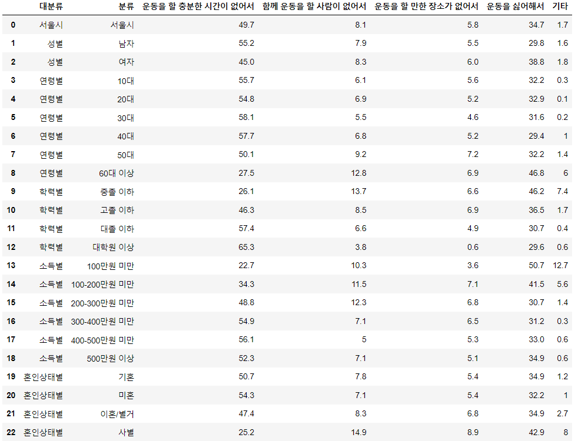
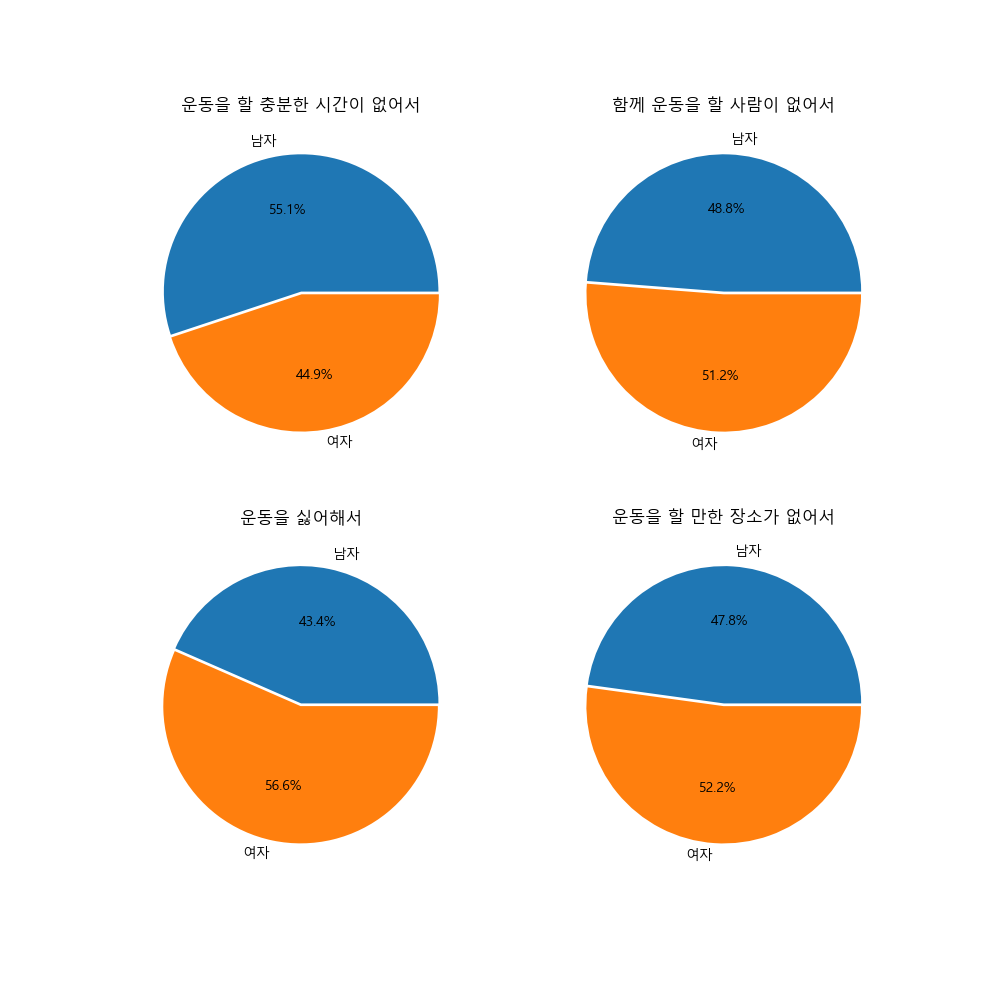
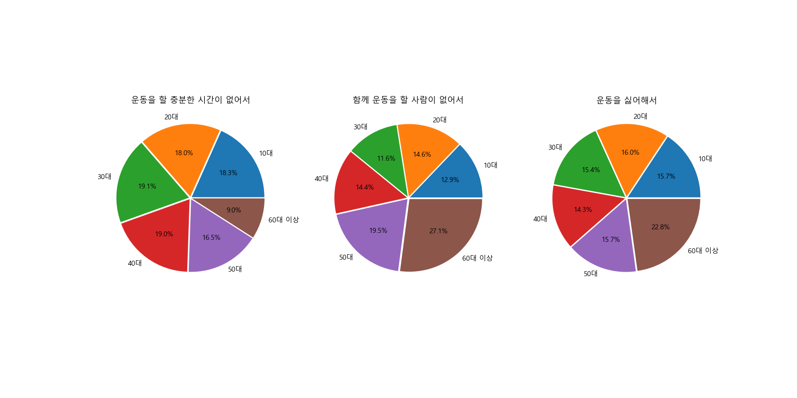
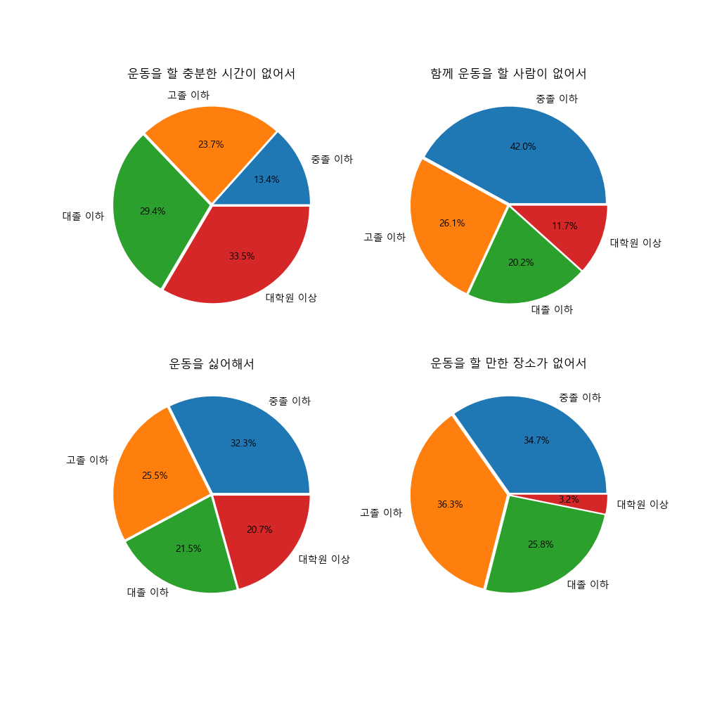

# 데이터의 처리 및 시각화 실습

>2022년 08월 19일 화요일

## 액셀 데이터를 불러와 분석하기
>Pandas와 Matplotlib를 활용하여 액셀 데이터를 업로드 후 조건에 맞게 분석해보는 실습
> 이번 프로젝트는 성별, 나이별, 학력별로 운동을 안 하는 이유에 대한 데이터를 분석하고 이를 시각화하는 작업이다.

### Process

1. 액셀 파일 다운로드 및 환경설정하기
   - [서울열린데이터광장](https://data.seoul.go.kr/index.do) 홈페이지에서 데이터를 다운받았음
   - 필요한 라이브러리 호출 
   - 주피터 환경에서 이 프로젝트를 진행하였는데, 한글 사용 시 깨짐 현상이 발생, 이를 방지하기 위한 코드 작성이 필수
    ```python
    import pandas as pd
    import matplotlib.pyplot as plt

    plt.rc("font", family="Malgun Gothic")
    ```

2. Jupyter notebook에 파일 업로드하고 정제하기
   - 액셀 파일은 되도록이면 프로젝트 파일과 같은 경로에 두는 것이 편하다.
   - drop 함수로 필요한 행과 열만 추출한다
   - inplace=True로 설정해야 데이터프레임 수정사항이 반영된 상태로 작업이 가능하다.
    ```python
    df1 = pd.read_excel('notExercise.xlsx')
    df1.drop(columns='기간',inplace=True)
    df1.drop(index=range(23,53),inplace=True)
    df1
    ```


3. 데이터 선택 후 조건에 따라 분류하기
> 아래의 코드를 실행시키면 df_gender, df_age, df_edu에 각각의 조건에 맞는 DataFrame이 저장된다. 

```python
df_gender=df1[df1['대분류']=='성별'].copy() #성별에 따른 분류
df_gender.drop(columns='대분류',inplace=True) #대분류 열 제거 
df_gender.set_index('분류',inplace=True) #분류 열은 index로

df_age=df1[df1['대분류']=='연령별'].copy() #연령에 따른 분류
df_age.drop(columns='대분류',inplace=True)
df_age.set_index('분류',inplace=True)

df_edu = df1[df1['대분류']=='학력별'].copy() #학력에 따른 분류
df_edu.drop(columns = '대분류', inplace = True)
df_edu.set_index('분류',inplace = True) 
```

4. 데이터 시각화하기
> 데이터 정제 완료 후, 파이 그래프를 이용하여 데이터를 각 조건에 맞게 그래프화

```python
figure,ax=plt.subplots(2,2,figsize=(10,10))

df_gender['운동을 할 충분한 시간이 없어서'].plot.pie(explode=[0,0.02], ax = ax[0][0], autopct = '%1.1f%%')
ax[0][0].set_title('운동을 할 충분한 시간이 없어서')
ax[0][0].set_ylabel('')

df_gender['함께 운동을 할 사람이 없어서'].plot.pie(explode=[0,0.02], ax = ax[0][1], autopct = '%1.1f%%')
ax[0][1].set_title('함께 운동을 할 사람이 없어서')
ax[0][1].set_ylabel('')

df_gender['운동을 싫어해서'].plot.pie(explode=[0,0.02], ax = ax[1][0], autopct = '%1.1f%%')
ax[1][0].set_title('운동을 싫어해서')
ax[1][0].set_ylabel('')

df_gender['운동을 할 만한 장소가 없어서'].plot.pie(explode=[0,0.02], ax = ax[1][1], autopct = '%1.1f%%')
ax[1][1].set_title('운동을 할 만한 장소가 없어서')
ax[1][1].set_ylabel('')

plt.savefig('noEx_gender.png',dpi =100)
plt.show() 
```


---
```python
figure,ax=plt.subplots(1,3,figsize=(16,8))

explode_set = [0.02,0.02,0.02,0.02,0.02,0.02]

df_age['운동을 할 충분한 시간이 없어서'].plot.pie(explode=explode_set, ax = ax[0],autopct = '%1.1f%%')
ax[0].set_title('운동을 할 충분한 시간이 없어서')
ax[0].set_ylabel('')

df_age['함께 운동을 할 사람이 없어서'].plot.pie(explode=explode_set,
ax = ax[1], autopct = '%1.1f%%')
ax[1].set_title('함께 운동을 할 사람이 없어서')
ax[1].set_ylabel('')

df_age['운동을 싫어해서'].plot.pie(explode=explode_set,
                                  ax = ax[2],
                                  autopct = '%1.1f%%')
ax[2].set_title('운동을 싫어해서')
ax[2].set_ylabel('')

plt.savefig('noEx_age.png',dpi =100)
plt.show()
```

---
```python
figure,ax=plt.subplots(2,2,figsize=(10,10))
explode_set = [0.02,0.02,0.02,0.02]

df_edu['운동을 할 충분한 시간이 없어서'].plot.pie(explode=explode_set, ax = ax[0][0], autopct = '%1.1f%%')
ax[0][0].set_title('운동을 할 충분한 시간이 없어서')
ax[0][0].set_ylabel('')

df_edu['함께 운동을 할 사람이 없어서'].plot.pie(explode=explode_set, ax = ax[0][1], autopct = '%1.1f%%')
ax[0][1].set_title('함께 운동을 할 사람이 없어서')
ax[0][1].set_ylabel('')

df_edu['운동을 싫어해서'].plot.pie(explode=explode_set,
                                  ax = ax[1][0],
                                  autopct = '%1.1f%%')
ax[1][0].set_title('운동을 싫어해서')
ax[1][0].set_ylabel('')

df_edu['운동을 할 만한 장소가 없어서'].plot.pie(explode=explode_set, ax = ax[1][1], autopct = '%1.1f%%')
ax[1][1].set_title('운동을 할 만한 장소가 없어서')
ax[1][1].set_ylabel('')

plt.savefig('noEx_edu.png',dpi =100)
plt.show()
```
