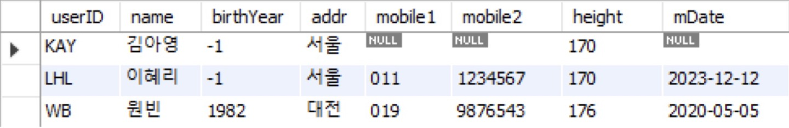

# SQL로 테이블 생성하기

## usertbl, buytbl 생성

---

```SQL
DROP TABLE IF EXISTS buytbl, usertbl;
CREATE TABLE usertbl
(   num INT AUTO_INCREMENT NOT NULL PRIMARY KEY,
    userid CHAR(8) NOT NULL,
    prodName CHAR(6) NOT NULL,
    groupName CHAR(4) NULL,
    price INT NOT NULL,
    amount SMALLINT NOT NULL
);
-- NULL: 널값을 허용 | NOT NULL: 널값을 허용하지 않음
CREATE TABLE buytbl
(   num INT AUTO_INCREMENT NOT NULL PRIMARY KEY,
    userid CHAR(8) NOT NULL,
    prodName CHAR(6) NOT NULL,
    groupName CHAR(4) NULL,
    price INT NOT NULL,
    amount SMALLINT NOT NULL,
    FOREIGN KEY(userid) REFERENCES usertbl(userID) -- usertbl의 userID를 참조한다
);
```
---
## usertbl, buytbl에 데이터 입력하기
> 구매 테이블이 회원 테이블을 참조하는 형태

### 회원 테이블 데이터 입력
- INSERT INTO usertbl VALUES('LSG','이승기',1987,'서울','011','1111111',182,'2008-8-8');
- INSERT INTO usertbl VALUES('KBS','김범수',1971,'전남','019','2222222',173,'2012-4-4');
- INSERT INTO usertbl VALUES('KKH','김경호',1971,'전남','019','3333333',177,'2007-7-7');

### 구매 테이블 데이터 입력
- INSERT INTO buytbl VALUES(NULL,'KBS','운동화',NULL,30,2);
- INSERT INTO buytbl VALUES(NULL,'KBS','노트북','전자',1000,1);
- INSERT INTO buytbl VALUES(NULL,'JYP','모니터','전자',200,1);
  - 이 3번째 행처럼 입력하는 경우 'JYP'는 usertbl에서 참조할 수 있는 데이터가 없으므로 에러가 발생한다.
---
## 제약 조건
> 특정 데이터를 입력 시 어떠한 조건을 만족했을 때에 입력되도록 함

### 기본 키(Primary Key) 제약 조건
> 테이블에 존재하는 많은 행의 데이터를 구분할 수 있는 식별자

- 중복이나 NULL값이 입력될 수 없다
- 테이블에서는 기본 키를 하나 이상 열에 설정이 가능함
```SQL
DROP TABLE IF EXISTS usertbl;
CREATE TABLE usertbl
(
    userID CHAR(8) NOT NULL,
    name VARCHAR(10) NOT NULL,
    birthYear INT NOT NULL,
    CONSTRAINT PRIMARY KEY PK_usertbl_userID(userID)
    -- userID를 primary key로 설정
);

DROP TABLE IF EXISTS prodTbl;
CREATE TABLE prodTbl
(
    prodCode CHAR(3) NOT NULL,
    prodID CHAR(4) NOT NULL,
    prodDate DATETIME NOT NULL,
    prodCur CHAR(10) NULL,
    CONSTRAINT PK_prodTbl_proCode_prodID
        PRIMARY KEY(prodCode, prodID)
    -- prodCode, prodID를 primary key로 설정
);
```

### 외래 키(Foreign Key) 제약 조건
> 두 테이블 사이의 관계 선언하여 데이터의 무결성 보장해주는 역할

- 하나의 테이블이 다른 테이블에 의존하는 관계
- 외래 키 테이블이 참조하는 기준 테이블의 열은 반드시 Primary Key이거나 Unique 제약 조건이 설정되어 있어야 함
- 기준 테이블의 데이터가 변경되었을 때 외래 키 테이블도 자동으로 적용되도록 설정

```SQL
DROP TABLE IF EXISTS buytbl, usertbl;
CREATE TABLE usertbl
(   userID CHAR(8) NOT NULL PRIMARY KEY,
    name VARCHAR(10) NOT NULL,
    birthYear INT NOT NULL
);

CREATE TABLE buytbl
(   num INT AUTO_INCREMENT NOT NULL PRIMARY KEY,
    userid CHAR(8) NOT NULL,
    prodName CHAR(6) NOT NULL,
    FOREIGN KEY(userID) REFERENCES usertbl(userID) -- usertbl의 userID를 참조한다
);
```
- ALTER TABLE 구문 이용하여 외래키 생성하기

```sql
DROP TABLE IF EXISTS buytbl;
CREATE TABLE buytbl
(
    num INT AUTO_INCREMENT NOT NULL PRIMARY KEY,
    userID CHAR(8) NOT NULL,
    prodName CHAR(6) NOT NULL
);
ALTER TABLE buytbl
    ADD CONSTRAINT FK_usertbl_buytbl
    FOREIGN KEY(userID)
    REFERENCES usertbl(userID);
```

- UNIQUE 제약 조건
  - 중복되지 않은 유일한 값을 입력해야 하는 조건
  - PRIMARY KEY와 비슷하나 UNIQUE는 NULL값을 허용한다
  - NULL은 여러 개가 입력되어도 상관없다
```SQL
USE tableDB;
DROP TABLE IF EXISTS buytbl, usertbl;
CREATE TABLE usertbl
(
    userID CHAR(8) NOT NULL PRIMARY KEY,
    name VARCHAR(10) NOT NULL,
    birthYear INT NOT NULL,
    email CHAR(30) NULL UNIQUE -- email값은 중복을 허용하지 않음
);
```

- CHECK 제약 조건
  - 입력되는 데이터를 점검하고, 조건에 맞지 않으면 입력하지 않는다
  - ALTER TABLE문으로 제약 조건 추가 가능

```SQL
-- 출생연도가 1900년 이후 그리고 2023년 이전, 이름은 반드시 넣어야 함
DROP TABLE IF EXISTS usertbl;
CREATE TABLE usertbl
(
    userID CHAR(8) PRIMARY KEY,
    name VARCHAR(10),
    birthYear INT CHECK(birthYear>=1900 AND birthYear<=2023),
    mobile1 CHAR(3) NULL,
    CONSTRAINT CK_name CHECK(name IS NOT NULL)
);
```

- DEFAULT 정의
  - 값 입력하지 않았을 때 자동으로 입력되는 기본 값을 정의한다
  - ALTER TABLE 사용 시에 열에 DEFAULT를 지정하기 위해서 ALTER COLUMN문 사용
```SQL
DROP TABLE IF EXISTS usertbl;
CREATE TABLE usertbl
(
    userID CHAR(8) NOT NULL PRIMARY KEY,
    name VARCHAR(10) NOT NULL,
    birthYear INT NOT NULL DEFAULT -1,
    addr CHAR(2) NOT NULL DEFAULT '서울',
    mobile1 CHAR(3) NULL,
    height SMALLINT NULL DEFAULT 170,
    mDate DATE NULL
);
```
- Default 설정된 열에는 다음과 같은 방법으로 데이터를 입력한다
```SQL
INSERT INTO usertbl VALUES('LHL','이혜리',default,default,'011','1234567',default,'2023.12.12');

-- 열 이름이 명시되지 않으면 default로 설정된 값을 자동으로 입력
INSERT INTO usertbl(userID,name) VALUES('KAY','김아영');

-- 값이 직접 명기되면 default로 설정된 값은 무시
INSERT INTO usertbl VALUES('WB','원빈',1982,'대전','019','9876543',176,'2020.5.5');

SELECT * FROM usertbl;
```


